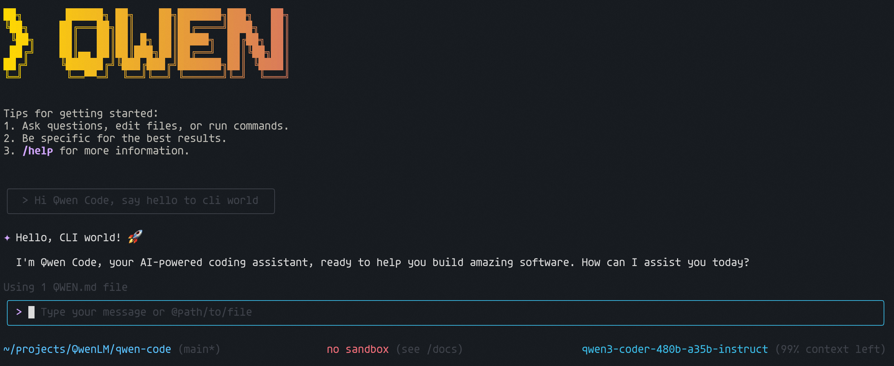

# Qwen Code - 내부망 LLM 지원 버전



Qwen Code는 내부망 환경에서 자체 LLM 모델을 사용할 수 있도록 수정된 AI 코딩 어시스턴트입니다.
[**Gemini CLI**](https://github.com/google-gemini/gemini-cli)를 기반으로 하여 내부망 LLM 서버와 연동할 수 있습니다.

## 🚀 빠른 시작 (3단계)

### 1단계: 설치
```bash
git clone <this-repository>
cd qwen-code
npm install
```

### 2단계: 내부망 LLM 설정
```bash
# 내부망 설정 활성화
npm run setup-internal
```

### 3단계: 사용
```bash
# 테스트 서버 실행 (별도 터미널)
npm run test:proxy

# qwen 실행
npm run qwen
```

## 🌐 글로벌 설치 (권장)

한 번 설치하면 어디서든 `qwen` 명령어 사용 가능:

```bash
# 글로벌 설치
npm run install-global

# 어디서든 사용
cd /any/directory
qwen
```

## 📋 명령어 모음

| 명령어 | 설명 |
|--------|------|
| `npm run setup-internal` | 내부망 LLM 설정 활성화 |
| `npm run test:proxy` | 테스트용 프록시 서버 실행 |
| `npm run qwen` | qwen 실행 (로컬) |
| `npm run install-global` | 글로벌 설치 |
| `qwen` | qwen 실행 (글로벌 설치 후) |

## ⚙️ 내부망 설정

설정은 자동으로 감지됩니다:

### 로컬 설정 (프로젝트별)
`.env` 파일:
```env
INTERNAL_LLM_BASE_URL=http://your-internal-server:8443/api/v1
INTERNAL_LLM_API_KEY=your-api-key
INTERNAL_LLM_MODEL=your-model-name
```

### 글로벌 설정 (사용자별)
`~/.qwen/.env` 파일:
```env
INTERNAL_LLM_BASE_URL=http://your-internal-server:8443/api/v1
INTERNAL_LLM_API_KEY=your-api-key
INTERNAL_LLM_MODEL=your-model-name
```

## 🔧 실제 내부망 서버 연결

테스트 서버 대신 실제 내부망 LLM 서버 사용:

1. **설정 파일 수정** (`.env` 또는 `~/.qwen/.env`):
```env
INTERNAL_LLM_BASE_URL=http://your-internal-llm-server.com/api/v1
INTERNAL_LLM_API_KEY=your-actual-api-key
INTERNAL_LLM_MODEL=your-model-name
NODE_TLS_REJECT_UNAUTHORIZED=0  # SSL 우회 필요시
```

2. **실행**:
```bash
qwen  # 자동으로 내부망 서버로 연결
```

## 📝 OpenAI API 호환성

내부망 LLM 서버는 OpenAI Chat Completions API와 호환되어야 합니다:

**엔드포인트**: `POST /chat/completions`

**요청 형식**:
```json
{
  "model": "your-model",
  "messages": [{"role": "user", "content": "Hello"}],
  "max_tokens": 2000,
  "temperature": 0.7
}
```

**응답 형식**:
```json
{
  "choices": [{
    "message": {
      "role": "assistant", 
      "content": "Hello! How can I help you?"
    },
    "finish_reason": "stop"
  }],
  "usage": {"total_tokens": 30}
}
```

## 🔄 모드 전환

### 내부망 모드 → 일반 모드
```bash
# 설정 파일 백업
mv .env .env.backup           # 로컬 설정
mv ~/.qwen/.env ~/.qwen/.env.backup  # 글로벌 설정
```

### 일반 모드 → 내부망 모드  
```bash
# 설정 파일 복원
mv .env.backup .env           # 로컬 설정
mv ~/.qwen/.env.backup ~/.qwen/.env  # 글로벌 설정
```

## 🐛 문제 해결

### "Connection error" 발생시
1. 프록시 서버가 실행 중인지 확인: `npm run test:proxy`
2. 포트 확인: `curl http://localhost:8443/devport/api/v1/chat/completions`
3. 설정 확인: `.env` 파일의 URL이 정확한지 확인

### 설정이 적용되지 않을 때
```bash
# 디버그 모드로 실행 (설정 로드 과정 확인)
DEBUG=1 qwen
```

### 글로벌 설치 문제
```bash
# 기존 설치 제거 후 재설치
npm uninstall -g @qwen-code/qwen-code
npm run install-global
```

## 📁 파일 구조

```
qwen-code/
├── .env                     # 로컬 내부망 설정
├── test-proxy-server.js     # 테스트용 프록시 서버
├── setup-global-internal-llm.js  # 글로벌 설정 스크립트
├── package.json            # npm 스크립트 포함
└── packages/               # 소스 코드
```

## 🌟 주요 기능

- **내부망 LLM 지원** - 외부 인터넷 없이 내부 LLM 서버 사용
- **자동 설정 감지** - `.env` 파일 기반 자동 구성
- **OpenAI API 호환** - 표준 API 형식 지원
- **SSL 우회 지원** - 자체 서명 인증서 환경 대응
- **글로벌/로컬 설정** - 사용자별/프로젝트별 설정 가능

## 📚 추가 정보

- **보안**: `NODE_TLS_REJECT_UNAUTHORIZED=0`은 개발/테스트 환경에서만 사용하세요
- **성능**: 내부망 LLM 응답 속도는 서버 성능에 따라 달라집니다
- **호환성**: OpenAI API 호환 서버라면 모든 LLM 모델 사용 가능합니다

## 🔗 원본 프로젝트

이 프로젝트는 [Google Gemini CLI](https://github.com/google-gemini/gemini-cli)를 기반으로 하여 내부망 LLM 지원 기능을 추가했습니다.

## 📄 라이선스

[LICENSE](./LICENSE)