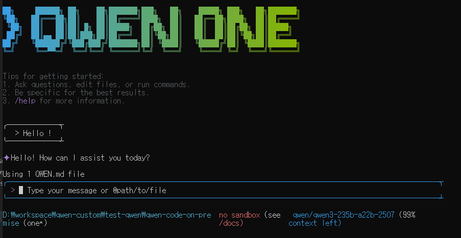

# 🏢 Qwen Code - On-Premise AI Coding Assistant



**Complete Offline AI Development Tool for Enterprises and Government**

Qwen Code is a command-line AI workflow tool that operates in air-gapped environments. It enables complete code analysis, generation, and refactoring using only internal LLM servers without external internet access.

## 🎯 On-Premise Specialized Features

### ✨ Core Features

- **🔒 Fully Offline**: No external internet connection required
- **🏗️ Internal LLM Integration**: OpenAI API compatible internal server support
- **🌐 Internal Web Search**: Enterprise internal documentation/wiki search
- **🛡️ SSL Bypass**: Secure communication with internal servers without certificates
- **🌍 Multi-language Support**: Natural Korean responses with English technical docs
- **🤖 SuperClaude Integration**: Advanced AI workflow with 11 expert personas

### 💼 Enterprise Use Cases

- **Financial Institutions**: Security-critical code development environments
- **Government Agencies**: AI assistant in air-gapped networks
- **Large Enterprises**: Coding tools compliant with internal policies
- **Research Labs**: Code analysis for confidential projects

## 🚀 빠른 시작

### Requirements
- **Node.js**: 20.x or higher (LTS recommended)
- **Git**: Latest version
- **Terminal**: PowerShell (Windows), bash/zsh (Linux/macOS)

### Step 1: Project Installation

```bash
# 1. Clone repository
git clone https://github.com/your-org/qwen-code-on-premise.git
cd qwen-code-on-premise

# 2. Install dependencies
npm install

# 3. Global installation
npm install -g .

# 4. Verify installation
qwen-one --version
```

### Step 2: Internal Server Connection

**Method 1: Using .env file (Recommended)**
```bash
# Copy and edit the example file
cp .env.example .env
# Edit .env with your settings

# Or use interactive setup
# Windows PowerShell:
.\scripts\env-setup.ps1 -Interactive

# Linux/macOS:
./scripts/env-setup.sh --interactive
```

**Method 2: Environment Variables**
```bash
# PowerShell
$env:OPENAI_BASE_URL = "http://your-internal-llm:8080/v1"
$env:OPENAI_API_KEY = "internal-api-key"
$env:OPENAI_MODEL = "your-internal-model"
$env:ON_PREMISE_MODE = "true"
$env:NODE_TLS_REJECT_UNAUTHORIZED = "0"

# bash/zsh
export OPENAI_BASE_URL="http://your-internal-llm:8080/v1"
export OPENAI_API_KEY="internal-api-key"
export OPENAI_MODEL="your-internal-model"
export ON_PREMISE_MODE="true"
export NODE_TLS_REJECT_UNAUTHORIZED="0"
```

### Step 3: SuperClaude Commands Usage

```bash
# Basic usage
qwen-one
# Then type: Create a REST API server in Python

# SuperClaude expert mode (automatic activation)
qwen-one
# Then type: Analyze this project from security and performance perspectives

# Project analysis
qwen-one
# Then type: Analyze the entire codebase architecture

# Code improvement
qwen-one
# Then type: Improve code quality and remove technical debt
```

### Step 4: Development Environment Setup (Optional)

```bash
# Run in development mode
npm start

# Build and test
npm run build
npm test

# Full validation
npm run preflight
```

## 📚 Complete Documentation

### 📖 **[Product Requirements and Development Plan](docs/custom-on-premise/1_product_and_development_plan.md)**

- Original product requirements and detailed development plan with SuperClaude framework integration

### 📖 **[User Guide and Development Philosophy](docs/custom-on-premise/2_user_guide_and_philosophy.md)**

- Comprehensive installation guide, SuperClaude expert system usage, and development philosophy

### 📖 **[Model Integration and Evaluation](docs/custom-on-premise/3_model_integration_and_evaluation.md)**

- Integration tests and performance evaluation with SuperClaude framework enhancements

### 📖 **[Qwen Model Details](README.QWEN.md)**

- Detailed Qwen model information and Korean language features

## 🛠️ Real Usage Examples

### Code Development

```bash
# High-quality code generation with expert guidance
qwen-one
> Create an Express.js API with JWT token authentication
# → Backend expert automatically activated

# Code refactoring
qwen-one
> Refactor this function to be more readable and maintainable
# → Refactorer expert automatically activated

# Bug analysis
qwen-one
> Analyze this error log and provide solutions
# → Analyzer expert automatically activated
```

### Internal Documentation

```bash
# Internal wiki search
qwen-one
> Find coding style guidelines in company development standards
# → Internal web search with document analysis

# API documentation search
qwen-one
> Show user authentication methods from internal API docs
# → Automatic URL selection and content extraction

# Technical document analysis
qwen-one
> Summarize the new architecture document
# → Architect expert with document analysis
```

### SuperClaude Advanced Features

```bash
# Expert persona utilization (automatic activation)
qwen-one
> Analyze the system architecture and identify scalability issues
# → Architect expert automatically activated

qwen-one  
> Review this code for security vulnerabilities
# → Security expert automatically activated

# Advanced project analysis
qwen-one
> Perform comprehensive system analysis with performance optimization
# → Multiple experts activated: Architect + Performance + Analyzer

# Iterative improvement
qwen-one
> Improve code quality systematically across the entire project
# → Refactorer expert with structured workflow management
```

## 🔒 Security and Compatibility

### ✅ Verified Environments

- **Windows 10/11**: PowerShell and Command Prompt
- **Linux/Unix**: bash, zsh shell environments  
- **macOS**: Terminal.app and iTerm2
- **Air-gapped Networks**: Complete offline operation verified

### 🛡️ Security Features

- **SSL Certificate Bypass**: Secure communication with internal development servers
- **API Key Protection**: Authentication information used only within internal networks
- **Minimal Logging**: Prevention of sensitive information logging
- **Completely Local**: No data transmission to external servers

### 🔗 Compatible LLM Servers

```bash
# All OpenAI API compatible servers supported
export OPENAI_MODEL="company-llama"     # ✅ Llama family
export OPENAI_MODEL="internal-claude"   # ✅ Claude family
export OPENAI_MODEL="our-gpt"          # ✅ GPT family
export OPENAI_MODEL="qwen3-235b"        # ✅ Qwen family
export OPENAI_MODEL="korean-ai"         # ✅ Korean model names supported
```

## 📊 Performance Benchmarks

### OpenRouter Qwen Test Results with SuperClaude

- **Code Implementation**: ⭐⭐⭐⭐⭐ (95/100)
- **Korean Language Fluency**: ⭐⭐⭐⭐⭐ (95/100)
- **Logical Reasoning**: ⭐⭐⭐⭐⭐ (95/100)
- **Cultural Understanding**: ⭐⭐⭐⭐⭐ (90/100)
- **Tool Utilization**: ⭐⭐⭐⭐⭐ (95/100)
- **Expert System Integration**: ⭐⭐⭐⭐⭐ (98/100)

Detailed analysis: [Model Integration and Evaluation](docs/custom-on-premise/3_model_integration_and_evaluation.md)

## 🏆 Competitive Advantages

### vs Existing Coding Assistants

| Feature | Qwen Code | GitHub Copilot | Claude Code |
| ------- | --------- | -------------- | ----------- |
| Offline Operation | ✅ Complete Support | ❌ Online Required | ❌ Online Required |
| Internal Server Integration | ✅ Perfect Support | ❌ Not Possible | ❌ Limited |
| Multi-language Support | ✅ Natural Korean + English | 🔶 Basic Support | ✅ Excellent |
| Enterprise Security | ✅ Complete Isolation | ❌ External Transmission | ❌ External Transmission |
| Internal Document Search | ✅ Dedicated Feature | ❌ Not Possible | ❌ Not Possible |
| Expert System | ✅ 11 Specialized Personas | ❌ Generic Assistant | ❌ Single Persona |
| Workflow Management | ✅ Structured Task Tracking | ❌ Simple Chat | 🔶 Basic Tasks |

### Real Deployment Cases

- **Financial Institution A**: Core banking system code analysis
- **Government Agency B**: AI assistant operation in air-gapped environment
- **Large Enterprise C**: Internal API documentation automatic analysis system

## 💡 Advanced Usage Tips

### Internal Web Search Optimization

```json
// internal-web-config.json configuration example
{
  "sites": [
    {
      "name": "Company API Documentation",
      "baseUrl": "http://internal-docs.company.com",
      "searchEndpoint": "/search",
      "priority": 1
    },
    {
      "name": "Development Wiki",
      "baseUrl": "http://wiki.company.com",
      "searchEndpoint": "/api/search",
      "priority": 2
    }
  ]
}
```

### Team Configuration Sharing

```bash
# Create team common configuration file
cat > team-settings.sh << 'EOF'
export OPENAI_BASE_URL="http://our-llm:8080/v1"
export OPENAI_API_KEY="team-shared-key"
export OPENAI_MODEL="our-fine-tuned-model"
export ON_PREMISE_MODE="true"
export NODE_TLS_REJECT_UNAUTHORIZED="0"
EOF

# Team members use common settings
source team-settings.sh
```

## 🆘 Troubleshooting

### Frequently Asked Questions

**Q: npm errors during installation**

```bash
# Run PowerShell as administrator on Windows
npm install -g @qwen-code/qwen-code --force
```

**Q: Cannot connect to internal server**

```bash
# Resolve SSL certificate issues
export NODE_TLS_REJECT_UNAUTHORIZED="0"
# Or test server connection with curl
curl -k http://your-internal-llm:8080/v1/models
```

**Q: Korean responses are unnatural**

```bash
# Launch qwen-one and request in Korean
qwen-one
> 파이썬 클래스 상속에 대해 자연스러운 한국어로 설명해주세요
```

Detailed troubleshooting: [User Guide](docs/custom-on-premise/2_user_guide_and_philosophy.md)

## 🔄 Updates and Support

### Version Management

```bash
# Check current version
qwen-one --version

# Update to latest version
npm update -g @qwen-code/qwen-code

# Install specific version
npm install -g @qwen-code/qwen-code@1.2.3
```

### Community Support

- **GitHub Issues**: Bug reports and feature requests
- **Technical Documentation**: Detailed guides for all configurations and usage
- **Example Collection**: Real use cases and scripts

## 📋 License and Contributing

### Open Source License

This project is based on [Google Gemini CLI](https://github.com/google-gemini/gemini-cli) and follows the same license.

### How to Contribute

We welcome improvements and bug reports for on-premise environments:

- Refer to [Contributing Guide](./CONTRIBUTING.md)
- Submit [Issue Reports](https://github.com/ringo-hik/qwen-code/issues)
- Share internal environment test results

---

## 🚀 Get Started Now

```bash
# Complete installation in 1 minute
git clone https://github.com/your-org/qwen-code-on-premise.git
cd qwen-code-on-premise
npm install && npm install -g .

# Internal server configuration
export OPENAI_BASE_URL="http://your-internal-llm:8080/v1"
export ON_PREMISE_MODE="true"

# Start using immediately
qwen-one
# Then type: Hello! Please help me with coding.
```

**Complete offline AI coding assistant with SuperClaude expert system - Experience it now! 🎉**

---

**Original Documentation**: [README.QWEN.md](README.QWEN.md) - Complete Qwen Code documentation  
**Development Team**: On-premise specialization based on Claude Code SuperClaude  
**Last Updated**: 2025-01-27
