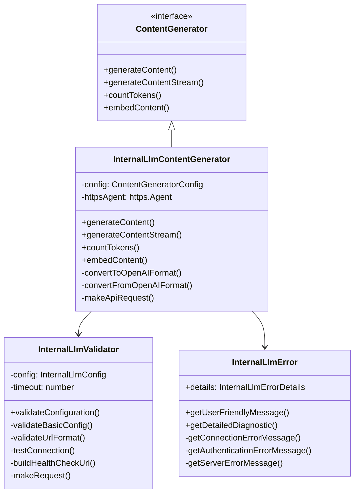
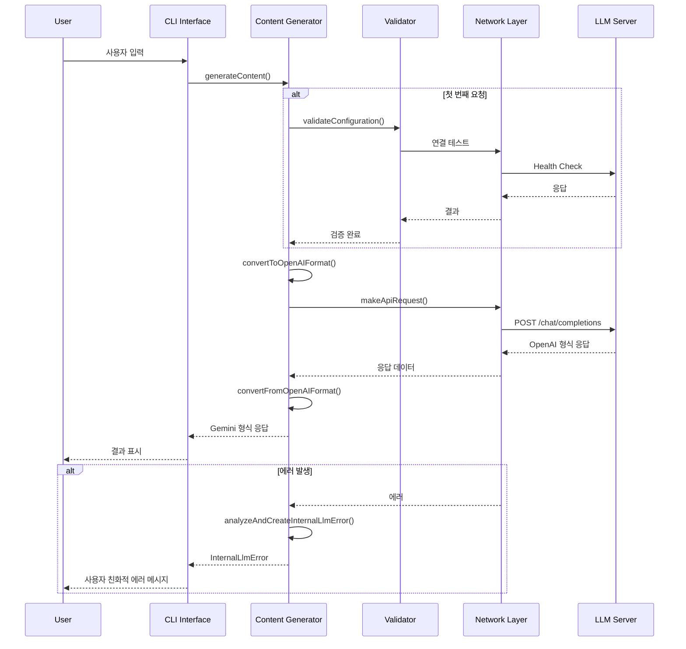
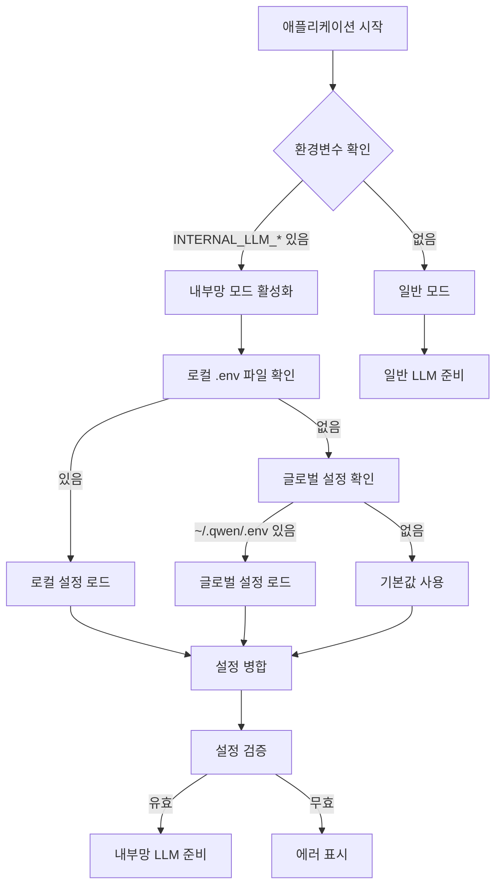
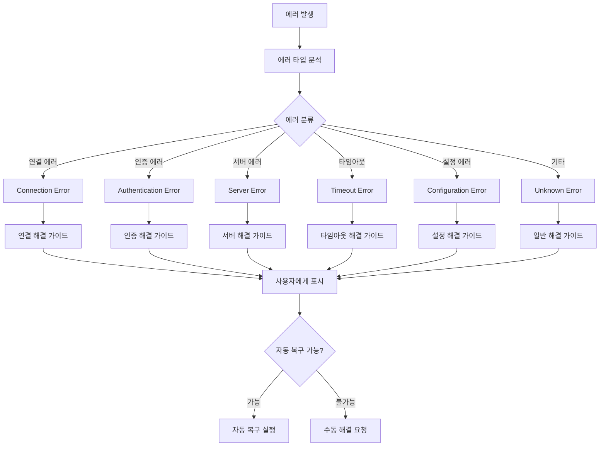

# 내부망 LLM 아키텍처 문서

Qwen Code의 내부망 LLM 지원 기능의 기술적 구조와 구현 세부사항을 설명합니다.

## 📋 목차

1. [시스템 아키텍처](#시스템-아키텍처)
2. [컴포넌트 구조](#컴포넌트-구조)
3. [데이터 플로우](#데이터-플로우)
4. [에러 처리](#에러-처리)
5. [성능 최적화](#성능-최적화)
6. [확장성](#확장성)

## 시스템 아키텍처

### 전체 구조

```
┌─────────────────┐    ┌─────────────────┐    ┌─────────────────┐
│   CLI Interface │    │   Web Interface │    │   IDE Extension │
│                 │    │                 │    │                 │
└─────────┬───────┘    └─────────┬───────┘    └─────────┬───────┘
          │                      │                      │
          └──────────────────────┼──────────────────────┘
                                 │
                    ┌─────────────▼──────────────┐
                    │      Qwen Code Core       │
                    │                           │
                    │  ┌─────────────────────┐  │
                    │  │ Content Generator   │  │
                    │  │   Abstraction      │  │
                    │  └─────────┬───────────┘  │
                    │            │              │
                    │  ┌─────────▼───────────┐  │
                    │  │ Internal LLM       │  │
                    │  │ Content Generator  │  │
                    │  └─────────┬───────────┘  │
                    └────────────┼──────────────┘
                                 │
                    ┌─────────────▼──────────────┐
                    │     Network Layer         │
                    │                           │
                    │  ┌─────────────────────┐  │
                    │  │   HTTP Client      │  │
                    │  │   (with SSL)       │  │
                    │  └─────────┬───────────┘  │
                    │            │              │
                    │  ┌─────────▼───────────┐  │
                    │  │   Error Handler    │  │
                    │  │   & Diagnostics    │  │
                    │  └─────────┬───────────┘  │
                    └────────────┼──────────────┘
                                 │
                    ┌─────────────▼──────────────┐
                    │    Internal LLM Server    │
                    │   (OpenAI Compatible)     │
                    └───────────────────────────┘
```

### 레이어 구조

#### 1. Presentation Layer (프레젠테이션 계층)
- **CLI Interface**: 터미널 기반 사용자 인터페이스
- **Web Interface**: 브라우저 기반 인터페이스 (향후 지원)
- **IDE Extension**: VS Code 등 IDE 통합

#### 2. Application Layer (애플리케이션 계층)
- **Command Processors**: 사용자 명령어 처리
- **Session Management**: 사용자 세션 관리
- **Configuration Management**: 설정 관리

#### 3. Domain Layer (도메인 계층)
- **Content Generation**: LLM 응답 생성 로직
- **Validation**: 설정 및 연결 검증
- **Error Analysis**: 에러 분석 및 분류

#### 4. Infrastructure Layer (인프라 계층)
- **Network Communication**: HTTP/HTTPS 통신
- **Security**: SSL/TLS 처리
- **Logging**: 로깅 및 모니터링

## 컴포넌트 구조

### Core 패키지 구조

```
packages/core/src/
├── core/
│   ├── contentGenerator.ts          # 기본 인터페이스
│   ├── internalLlmContentGenerator.ts  # 내부망 LLM 구현
│   └── ...
├── utils/
│   ├── internalLlmValidator.ts      # 설정 검증
│   ├── internalLlmErrorHandler.ts   # 에러 처리
│   └── ...
└── config/
    ├── config.ts                    # 설정 관리
    └── ...
```

### CLI 패키지 구조

```
packages/cli/src/
├── ui/
│   ├── commands/
│   │   ├── validateCommand.ts       # 검증 명령어
│   │   ├── diagnoseCommand.ts       # 진단 명령어
│   │   └── ...
│   └── components/
│       ├── Help.tsx                 # 도움말 UI
│       └── ...
├── config/
│   ├── auth.ts                      # 인증 관리
│   ├── settings.ts                  # 설정 관리
│   └── ...
└── services/
    ├── CommandService.ts            # 명령어 서비스
    └── ...
```

### 주요 클래스 다이어그램



## 데이터 플로우

### 요청 처리 플로우



### 설정 로딩 플로우



### 에러 처리 플로우



## 에러 처리

### 에러 계층 구조

```typescript
// 기본 에러 인터페이스
interface InternalLlmErrorDetails {
  type: 'connection' | 'authentication' | 'server' | 'timeout' | 'configuration' | 'unknown';
  statusCode?: number;
  originalError: Error;
  timestamp: Date;
  url?: string;
  suggestion?: string;
}

// 에러 클래스 계층
class InternalLlmError extends Error {
  public readonly details: InternalLlmErrorDetails;
  
  constructor(details: InternalLlmErrorDetails) {
    super(details.originalError.message);
    this.name = 'InternalLlmError';
    this.details = details;
  }
}
```

### 에러 분석 알고리즘

```typescript
function analyzeError(error: Error, context?: { url?: string; statusCode?: number }): InternalLlmError {
  const message = error.message.toLowerCase();
  let type: InternalLlmErrorDetails['type'] = 'unknown';
  
  // 네트워크 에러 패턴 매칭
  if (message.includes('econnrefused')) {
    type = 'connection';
  } else if (message.includes('etimedout')) {
    type = 'timeout';
  } else if (message.includes('enotfound')) {
    type = 'connection';
  }
  
  // HTTP 상태코드 기반 분류
  if (context?.statusCode) {
    if (context.statusCode >= 400 && context.statusCode < 500) {
      type = 'authentication';
    } else if (context.statusCode >= 500) {
      type = 'server';
    }
  }
  
  return new InternalLlmError({
    type,
    originalError: error,
    statusCode: context?.statusCode,
    url: context?.url,
    timestamp: new Date(),
  });
}
```

### 복구 전략

```typescript
class ErrorRecoveryManager {
  private retryCount = 0;
  private maxRetries = 3;
  
  async executeWithRetry<T>(operation: () => Promise<T>): Promise<T> {
    try {
      return await operation();
    } catch (error) {
      const llmError = analyzeAndCreateInternalLlmError(error as Error);
      
      if (this.shouldRetry(llmError) && this.retryCount < this.maxRetries) {
        this.retryCount++;
        const delay = this.calculateBackoffDelay(this.retryCount);
        await this.sleep(delay);
        return this.executeWithRetry(operation);
      }
      
      throw llmError;
    }
  }
  
  private shouldRetry(error: InternalLlmError): boolean {
    return ['timeout', 'server'].includes(error.details.type);
  }
  
  private calculateBackoffDelay(attempt: number): number {
    return Math.min(1000 * Math.pow(2, attempt), 10000);
  }
}
```

## 성능 최적화

### 연결 풀링

```typescript
class ConnectionPoolManager {
  private pool: Map<string, http.Agent> = new Map();
  
  getAgent(url: string): http.Agent {
    if (!this.pool.has(url)) {
      const isHttps = url.startsWith('https');
      const agent = isHttps 
        ? new https.Agent({
            keepAlive: true,
            maxSockets: 10,
            maxFreeSockets: 5,
            timeout: 60000,
            rejectUnauthorized: process.env.NODE_TLS_REJECT_UNAUTHORIZED !== '0',
          })
        : new http.Agent({
            keepAlive: true,
            maxSockets: 10,
            maxFreeSockets: 5,
            timeout: 60000,
          });
      
      this.pool.set(url, agent);
    }
    
    return this.pool.get(url)!;
  }
  
  cleanup(): void {
    for (const agent of this.pool.values()) {
      agent.destroy();
    }
    this.pool.clear();
  }
}
```

### 요청 캐싱

```typescript
class RequestCacheManager {
  private cache: Map<string, CacheEntry> = new Map();
  private ttl: number = 300000; // 5분
  
  interface CacheEntry {
    data: any;
    timestamp: number;
    ttl: number;
  }
  
  get(key: string): any | null {
    const entry = this.cache.get(key);
    if (!entry) return null;
    
    if (Date.now() - entry.timestamp > entry.ttl) {
      this.cache.delete(key);
      return null;
    }
    
    return entry.data;
  }
  
  set(key: string, data: any, customTtl?: number): void {
    this.cache.set(key, {
      data,
      timestamp: Date.now(),
      ttl: customTtl || this.ttl,
    });
  }
  
  generateKey(request: any): string {
    return crypto
      .createHash('md5')
      .update(JSON.stringify(request))
      .digest('hex');
  }
}
```

### 스트리밍 최적화

```typescript
class StreamingOptimizer {
  async generateContentStream(request: GenerateContentParameters): Promise<AsyncGenerator<GenerateContentResponse>> {
    const stream = this.createStream(request);
    
    return this.optimizeStream(stream);
  }
  
  private async* optimizeStream(stream: AsyncIterable<any>): AsyncGenerator<GenerateContentResponse> {
    let buffer = '';
    const chunkSize = 1024;
    
    for await (const chunk of stream) {
      buffer += chunk;
      
      // 청크가 충분히 클 때만 yield
      if (buffer.length >= chunkSize) {
        const response = this.parseChunk(buffer);
        if (response) {
          yield response;
          buffer = '';
        }
      }
    }
    
    // 남은 버퍼 처리
    if (buffer.length > 0) {
      const response = this.parseChunk(buffer);
      if (response) {
        yield response;
      }
    }
  }
}
```

## 확장성

### 플러그인 아키텍처

```typescript
interface LLMPlugin {
  name: string;
  version: string;
  initialize(config: PluginConfig): Promise<void>;
  processRequest(request: any): Promise<any>;
  processResponse(response: any): Promise<any>;
  cleanup(): Promise<void>;
}

class PluginManager {
  private plugins: Map<string, LLMPlugin> = new Map();
  
  async loadPlugin(plugin: LLMPlugin): Promise<void> {
    await plugin.initialize(this.getPluginConfig(plugin.name));
    this.plugins.set(plugin.name, plugin);
  }
  
  async processWithPlugins(request: any): Promise<any> {
    let processedRequest = request;
    
    // 요청 전처리
    for (const plugin of this.plugins.values()) {
      processedRequest = await plugin.processRequest(processedRequest);
    }
    
    // 실제 LLM 호출
    let response = await this.callLLM(processedRequest);
    
    // 응답 후처리
    for (const plugin of this.plugins.values()) {
      response = await plugin.processResponse(response);
    }
    
    return response;
  }
}
```

### 다중 서버 지원

```typescript
interface ServerConfig {
  url: string;
  apiKey: string;
  model: string;
  weight: number;
  priority: number;
}

class LoadBalancer {
  private servers: ServerConfig[] = [];
  private currentIndex = 0;
  
  addServer(config: ServerConfig): void {
    this.servers.push(config);
    this.servers.sort((a, b) => b.priority - a.priority);
  }
  
  async selectServer(): Promise<ServerConfig> {
    // Round-robin with priority
    const availableServers = this.servers.filter(server => 
      this.isServerHealthy(server)
    );
    
    if (availableServers.length === 0) {
      throw new Error('No healthy servers available');
    }
    
    const server = availableServers[this.currentIndex % availableServers.length];
    this.currentIndex++;
    
    return server;
  }
  
  private async isServerHealthy(server: ServerConfig): Promise<boolean> {
    try {
      const response = await fetch(`${server.url}/health`, {
        method: 'GET',
        timeout: 5000,
      });
      return response.ok;
    } catch {
      return false;
    }
  }
}
```

### 확장 포인트

1. **Custom Content Generators**: 새로운 LLM 서버 지원
2. **Authentication Plugins**: 다양한 인증 방식 지원
3. **Monitoring Plugins**: 커스텀 모니터링 솔루션 통합
4. **Caching Strategies**: 다양한 캐싱 전략 구현
5. **Protocol Adapters**: 다른 API 형식 지원

### 향후 확장 계획

```typescript
// 향후 지원 예정 기능들
interface FutureExtensions {
  // 멀티 모달 지원
  multiModal: {
    imageProcessing: boolean;
    audioProcessing: boolean;
    videoProcessing: boolean;
  };
  
  // 고급 캐싱
  advancedCaching: {
    distributedCache: boolean;
    persistentCache: boolean;
    semanticCache: boolean;
  };
  
  // 보안 강화
  enhancedSecurity: {
    endToEndEncryption: boolean;
    certificateValidation: boolean;
    apiKeyRotation: boolean;
  };
  
  // 모니터링 및 관찰성
  observability: {
    distributedTracing: boolean;
    metricsCollection: boolean;
    alerting: boolean;
  };
}
```

---

*이 문서는 Qwen Code v0.0.1-alpha.8 기준으로 작성되었습니다.*